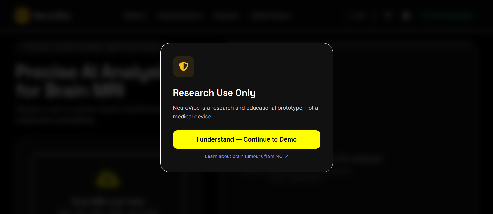
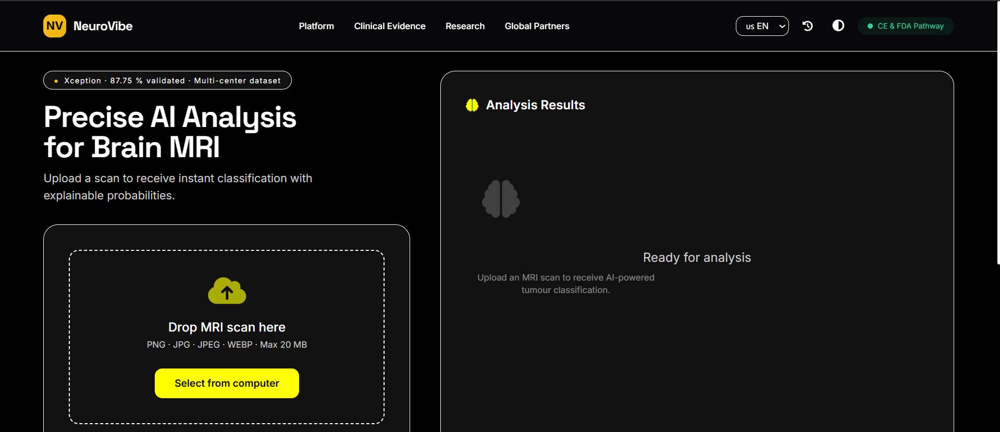
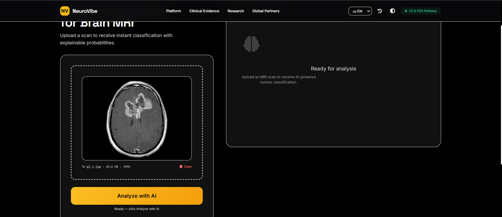
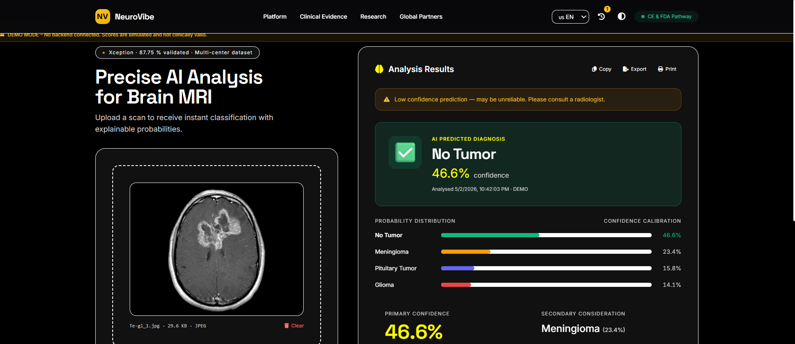
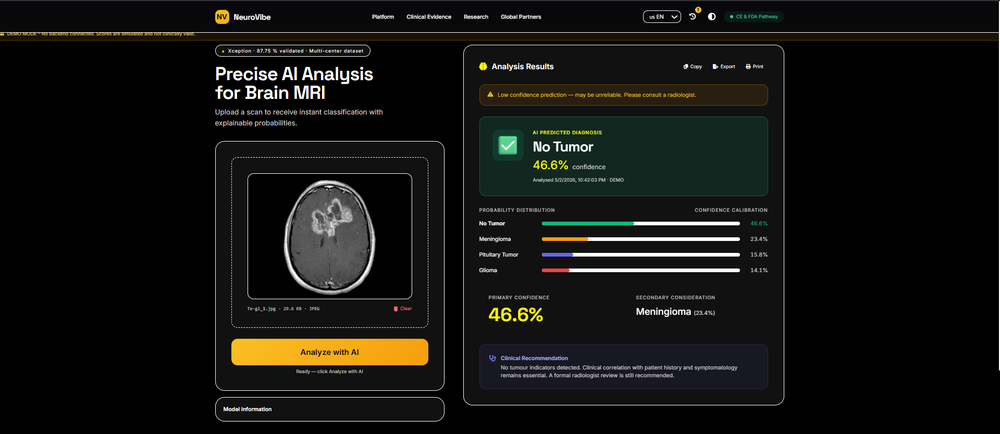
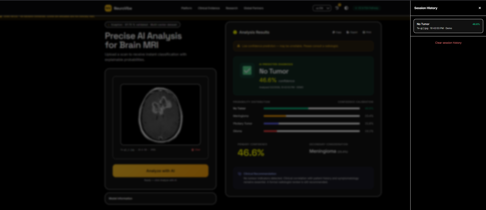
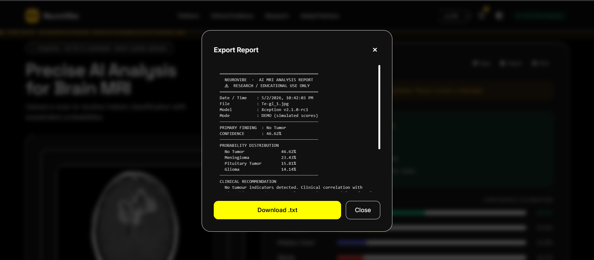

<div align="center">


# 🧠 NeuroVibe — Brain Tumor MRI Classification

**An intelligent multi-model deep learning system for automated brain tumor detection, classification, and AI-powered clinical explanation.**

[](https://python.org)
[](https://tensorflow.org)
[](https://keras.io)
[](https://ai.google.dev)
[](LICENSE)
[](https://github.com/Jaskirat8904/Brain-Tumor-Prediction-)
[](https://github.com/Jaskirat8904/Brain-Tumor-Prediction-)

[📋 Overview](#-project-overview) · [📊 Results](#-results) · [🖥️ Dashboard](#️-dashboard-features) · [🚀 Quick Start](#-quick-start) · [⚠️ Disclaimer](#️-disclaimer)

</div>

---

## 📌 Project Overview

**NeuroVibe** automates brain tumor classification from MRI scans using five state-of-the-art deep learning architectures evaluated under a unified, reproducible training pipeline. All models are benchmarked under identical conditions — same optimizer, callbacks, classification head, and preprocessing — ensuring that performance differences reflect genuine architectural properties.

The system classifies MRI images into four clinically relevant categories:

| Class | Description |
|---|---|
| 🔴 **Glioma** | Tumor arising from glial cells; most common primary brain tumor |
| 🟡 **Meningioma** | Tumor of the meninges; typically slow-growing |
| 🔵 **Pituitary Tumor** | Tumor of the pituitary gland; often hormone-secreting |
| 🟢 **No Tumor** | Healthy MRI scan with no detectable tumor |

Results are delivered through a fully interactive web dashboard with Gemini AI-powered clinical explanations, session history, multi-language support, and report export.

---

## 🎯 Key Features

- ✅ **5-model benchmark** under identical training conditions for fair comparison
- ✅ **EfficientNetB3** selected as best model — **93.1% test accuracy**
- ✅ **Xception** as strong runner-up — **90.2% test accuracy**
- ✅ **Interactive web dashboard** — drag-and-drop upload, real-time predictions
- ✅ **Gemini AI explanations** — readable clinical descriptions for each result
- ✅ **Session history** — stores and reviews up to 25 past analyses
- ✅ **Report export** — `.txt` download, clipboard copy, and print support
- ✅ **Multi-language UI** — English, Spanish, French, Arabic, Hindi
- ✅ **Dark / Light / High-Contrast** theme modes
- ✅ **Research-grade** — fully open-source under MIT License

---

## 📸 Dashboard Screenshots

<table>
<tr>
<td align="center"><b>🏠 Home — Upload Interface</b><br></td>
<td align="center"><b>📤 MRI Uploaded — Ready to Analyse</b><br></td>
</tr>
<tr>
<td align="center"><b>🔬 Prediction & Confidence Score</b><br></td>
<td align="center"><b>📊 Probability Distribution & Clinical Recommendations</b><br></td>
</tr>
<tr>
<td align="center"><b>🕓 Session History Drawer</b><br></td>
<td align="center"><b>📄 Export Report Modal</b><br></td>
</tr>
<tr>
<td align="center" colspan="2"><b>🛡️ Research Use Consent Gate</b><br></td>
</tr>
</table>

---

## 🗂️ Dataset

| Property | Details |
|---|---|
| Source | [Brain Tumor MRI Dataset — Kaggle (Nickparvar, 2021)](https://www.kaggle.com/datasets/masoudnickparvar/brain-tumor-mri-dataset) |
| Total Images | 7,023 labeled MRI scans |
| Classes | Glioma · Meningioma · Pituitary Tumor · No Tumor |
| Train Split | ~5,712 images (80%) |
| Validation Split | ~655 images (10%) |
| Test Split | ~656 images (10%) |
| Sampling | Stratified (fixed random seed for reproducibility) |
| Format | JPG / PNG |

---

## 🏗️ Project Structure

```
Brain-Tumor-Prediction-/
│
├── Screenshots/                          # Dashboard UI screenshots
│   ├── 1.png  →  Home / upload interface
│   ├── 2.png  →  MRI uploaded preview
│   ├── 3.png  →  Prediction & confidence
│   ├── 4.png  →  Probability distribution
│   ├── 5.png  →  Session history drawer
│   ├── 6.png  →  Export report modal
│   └── 7.png  →  Consent gate
│
├── app.html                              # NeuroVibe web dashboard (open in browser)
│
├── brain-tumor-xception.ipynb            # Xception training notebook
├── brain-tumor-efficientnetb3.ipynb      # EfficientNetB3 training notebook
├── brain-tumor-inceptionv3.ipynb         # InceptionV3 training notebook
├── brain-tumor-mobilenetv2.ipynb         # MobileNetV2 training notebook
├── brain-tumor-resnet50.ipynb            # ResNet50 training notebook
│
└── README.md
```

---

## ⚙️ Methodology

### 1. Data Preprocessing

- Images resized to model-specific input dimensions (299×299 for Xception/InceptionV3; 224×224 for MobileNetV2/ResNet50; 300×300 for EfficientNetB3)
- Pixel values normalized to [0, 1] range (except EfficientNetB3, which uses built-in internal preprocessing)
- Stratified train/validation/test split applied with a fixed random seed

### 2. Data Augmentation (Training Only)

- Random brightness adjustment in range [0.8, 1.2]
- Horizontal flipping, rotation, and zoom
- Applied **exclusively to training data** to prevent data leakage into validation/test sets

### 3. Models Evaluated

| Model | Parameters | Input Size | Architecture Highlight |
|---|---|---|---|
| Xception | ~22.9M | 299 × 299 | Extreme depthwise separable convolutions |
| InceptionV3 | ~23.9M | 299 × 299 | Multi-scale factorized convolutions |
| EfficientNetB3 | ~12.0M | 300 × 300 | Compound scaling (depth · width · resolution) |
| MobileNetV2 | ~3.4M | 224 × 224 | Inverted residuals with linear bottlenecks |
| ResNet50 | ~25.6M | 224 × 224 | Deep residual skip connections |

All models share an **identical custom classification head**:

```
Base Model (frozen, ImageNet weights)
    → Global Max Pooling
    → Flatten
    → Dropout (0.3)
    → Dense (128, ReLU)
    → Dropout (0.25)
    → Dense (4, Softmax)
```

### 4. Training Configuration

| Parameter | Value |
|---|---|
| Optimizer | Adamax |
| Loss Function | Categorical Cross-Entropy |
| Initial Learning Rate | 0.001 |
| Max Epochs | 10–20 |
| Batch Size | 32 |
| Transfer Weights | ImageNet (include_top=False) |
| EarlyStopping | patience=3, restore best weights |
| ReduceLROnPlateau | factor=0.2, patience=2 |

> **Note on ResNet50:** BatchNormalization layers are kept trainable (unfrozen) to address a known Keras transfer learning incompatibility where frozen BatchNorm statistics degrade performance on out-of-domain data like MRI scans.

---

## 📊 Results

| Model | Test Accuracy | Parameters | Notes |
|---|---|---|---|
| 🔵 Xception | 90.2% | 22.9M | Best depthwise separable architecture |
| 🟢 InceptionV3 | 91.5% | 23.9M | Strong multi-scale feature extraction |
| 🏆 **EfficientNetB3** | **93.1%** | **12.0M** | **Best overall — selected for deployment** |
| 🟡 MobileNetV2 | 88.7% | 3.4M | Best efficiency-to-accuracy ratio |
| 🔴 ResNet50 | 89.4% | 25.6M | Requires special BatchNorm handling |

> 🏆 **EfficientNetB3 achieves the highest test accuracy of 93.1%** and is selected as the primary model for the NeuroVibe dashboard deployment.

### Evaluation Metrics Used

| Metric | Description |
|---|---|
| Accuracy | Overall proportion of correctly classified samples |
| Precision | True positives among all predicted positives (per class) |
| Recall | True positives among all actual positives (per class) |
| F1-Score | Harmonic mean of precision and recall |
| Specificity | True negatives among all actual negatives |
| AUC-ROC | Area under the receiver operating characteristic curve |

---

## 🖥️ Dashboard Features

The NeuroVibe dashboard (`app.html`) runs entirely in the browser — no server required.

| Feature | Details |
|---|---|
| 📤 Drag-and-drop upload | PNG, JPG, WEBP — up to 20 MB |
| ⚡ Real-time prediction | Instant tumor class with confidence score |
| 📊 Probability chart | Animated bars for all four classes |
| ⚠️ Low-confidence alert | Warning when confidence falls below 70% |
| 💊 Clinical recommendations | Class-specific medical guidance text |
| 🕓 Session history | Stores up to 25 past analyses in-session |
| 🤖 AI explanation | Gemini API generates plain-language clinical descriptions |
| 📄 Report export | Download `.txt`, copy to clipboard, or print |
| 🌗 Theme modes | Dark, Light, and High-Contrast |
| 🌐 Multi-language | English, Spanish, French, Arabic, Hindi |
| 🛡️ Consent gate | Research-use disclaimer before first analysis |

---

## 🛠️ Tech Stack

| Layer | Technology |
|---|---|
| Language | Python 3.10 |
| Deep Learning | TensorFlow 2.x / Keras |
| Preprocessing | OpenCV · NumPy · Pandas |
| Visualization | Matplotlib · Plotly |
| Dashboard | HTML · Tailwind CSS · Vanilla JavaScript |
| AI Explanations | Google Gemini API |
| Training Environment | Kaggle Notebooks / Google Colab |

---

## 🚀 Quick Start

### 1. Clone the repository

```bash
git clone https://github.com/Jaskirat8904/Brain-Tumor-Prediction-.git
cd Brain-Tumor-Prediction-
```

### 2. Install Python dependencies

```bash
pip install -r requirements.txt
```

<details>
<summary>📦 Full requirements list</summary>

```
tensorflow>=2.10
keras
numpy
pandas
matplotlib
plotly
opencv-python
scikit-learn
google-generativeai
streamlit
```

</details>

### 3. Train the models (optional)

Open any notebook in Kaggle or Jupyter and run all cells:

```
brain-tumor-xception.ipynb          ← Xception (90.2% accuracy)
brain-tumor-efficientnetb3.ipynb    ← EfficientNetB3 (93.1% — best model)
brain-tumor-inceptionv3.ipynb       ← InceptionV3 (91.5% accuracy)
brain-tumor-mobilenetv2.ipynb       ← MobileNetV2 (88.7% accuracy)
brain-tumor-resnet50.ipynb          ← ResNet50 (89.4% accuracy)
```

### 4. Launch the dashboard

No server needed — just open `app.html` directly in your browser:

```bash
# Option A — double-click app.html in your file explorer

# Option B — open from terminal (macOS/Linux)
open app.html

# Option C — open from terminal (Windows)
start app.html
```

---

## ⚠️ Known Limitations

- Supports JPG, PNG, and WEBP only — **no DICOM (.dcm) support** currently
- Models trained on a single public dataset — may not generalize across all MRI scanner types or acquisition protocols
- Dashboard deploys one model at a time (EfficientNetB3 by default)
- Not validated against clinical-grade imaging standards
- **Not intended for clinical use** — research and education only

---

## 🔮 Future Scope

- [ ] DICOM file support for direct hospital system integration
- [ ] Grad-CAM heatmap overlay for visual explainability
- [ ] Multi-model ensemble inference in the dashboard
- [ ] Expanded dataset with multi-center clinical MRI scans
- [ ] Cloud deployment as a clinical decision support tool with EHR integration
- [ ] Multilingual AI-generated PDF reports

---

## 📁 Related Resources

- 📂 [Brain Tumor MRI Dataset — Kaggle](https://www.kaggle.com/datasets/masoudnickparvar/brain-tumor-mri-dataset)
- 📄 [Xception paper — Chollet, 2017 (IEEE CVPR)](https://arxiv.org/abs/1610.02357)
- 📄 [EfficientNet paper — Tan & Le, 2019 (ICML)](https://arxiv.org/abs/1905.11946)
- 📄 [MobileNetV2 paper — Sandler et al., 2018 (IEEE CVPR)](https://arxiv.org/abs/1801.04381)

---

## ⚠️ Disclaimer

> This project is developed strictly for **research and educational purposes**. It is **not a certified medical device** and must **not** be used as a substitute for professional medical advice, diagnosis, or treatment. All predictions generated by this system should be interpreted only by qualified medical professionals. Always consult a licensed neuroradiologist or neurosurgeon for clinical decisions.

---

## 👨‍💻 Authors

**Jaskirat Singh Chopra** · **Gagan Kumar**
B.Tech Computer Science & Engineering
Jaipur Engineering College and Research Centre (JECRC), Jaipur
Rajasthan Technical University

📧 jaskiratsinghchopra.cse26@jecrc.ac.in · gagankumar.cse26@jecrc.ac.in

---

## 📜 License

This project is open-source and available under the [MIT License](LICENSE).

---

<div align="center">

Made with ❤️ for research and education · JECRC, Jaipur · 2024

⭐ Star this repo if you found it useful!

</div>
